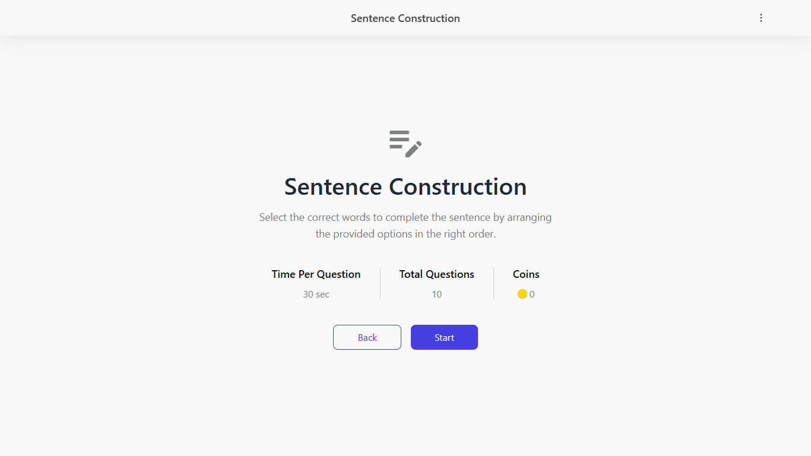
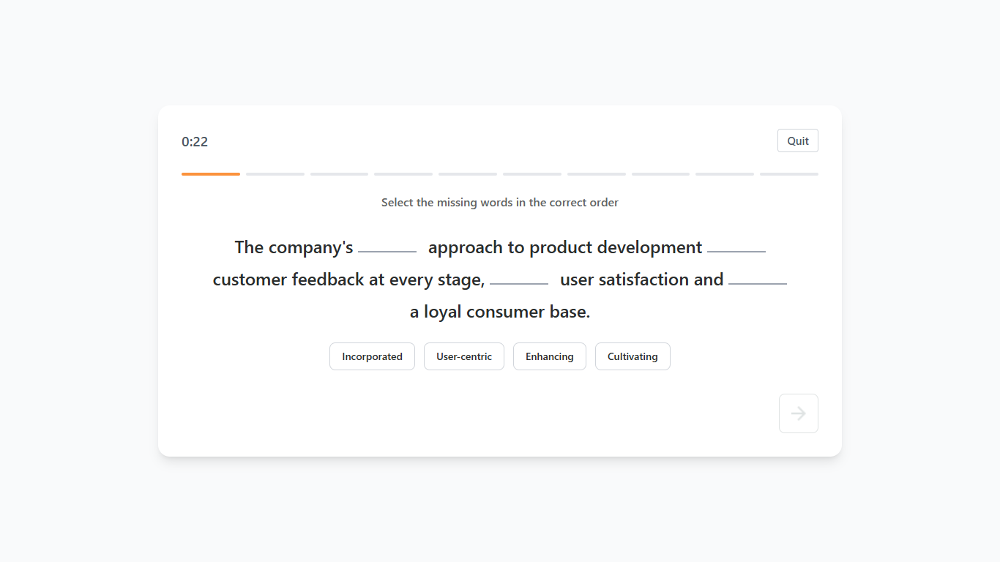
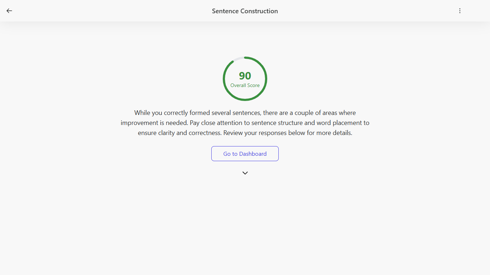

# 🧠 Sentence Construction Tool

An interactive React-based educational game that helps users improve their grammar and sentence construction skills. Built using React and Tailwind CSS.

---

## ✨ Features

- 🔤 **Sentence Completion Game** – Users fill in the blanks by selecting the correct sequence of words.
- ⏳ **Timer Functionality** – Each question has a 30-second time limit.
- 🎯 **Scoring System** – 10 points per correct sentence, final score shown on a result screen.
- 📊 **Result Analysis** – Displays each question with user's response marked as Correct/Incorrect.
- 🔁 **State Management** – User score and answers are stored using `localStorage`.
- ✅ **Responsive Design** – Fully responsive and mobile-friendly UI.
- 📦 **JSON Server Support** – Questions are fetched from a local JSON server or file.
- 💅 **Modern UI** – Built with React, Tailwind CSS, and shadcn/ui (optional).

---

## 🛠 Tech Stack

- **Frontend:** React, Tailwind CSS
- **Routing:** React Router
- **State Management:** useState, useEffect, localStorage
- **API:** JSON Server (local)

---

## 🖼 Screenshots

### 🏠 Home Page  


### 🧩 Quiz Page  


### 🏁 Result Page  


### 📋 Feedback Section (Correct/Incorrect)  


---

## 🚀 Getting Started

1. **Clone the repository**

```bash
git clone https://github.com/sangeetasonal/Sentence-Construction-Tool.git
cd sentence-construction-tool
```

2. **Install dependencies**

```bash
npm install
```

3. **Install JSON Server** (globally)

```bash
npm install -g json-server
```

4. **Run JSON Server**

Assuming you have `questions.json` in the root directory:

```bash
npm run api
```

5. **Run the app**

```bash
npm run dev
```

---


### 🔗 Live Demo

[Check out the live demo here](https://sentence-construction-tool-virid.vercel.app/)
